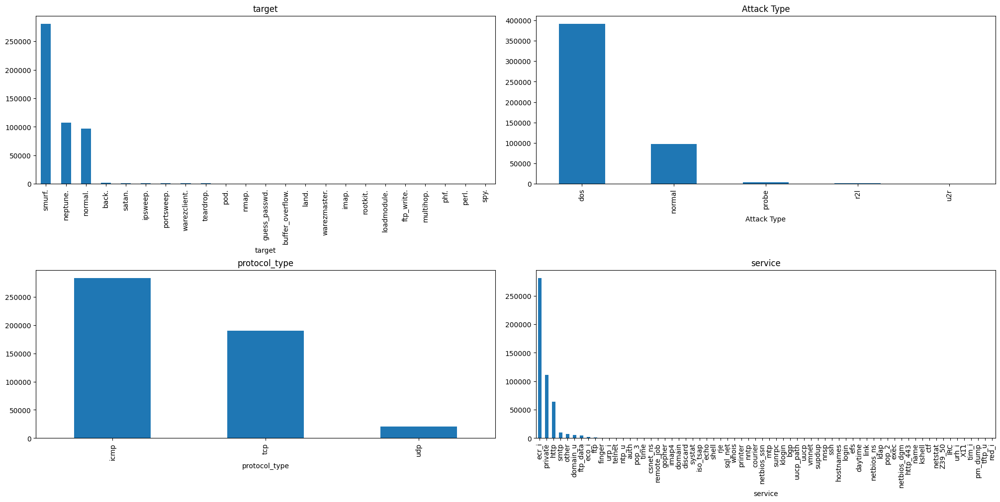
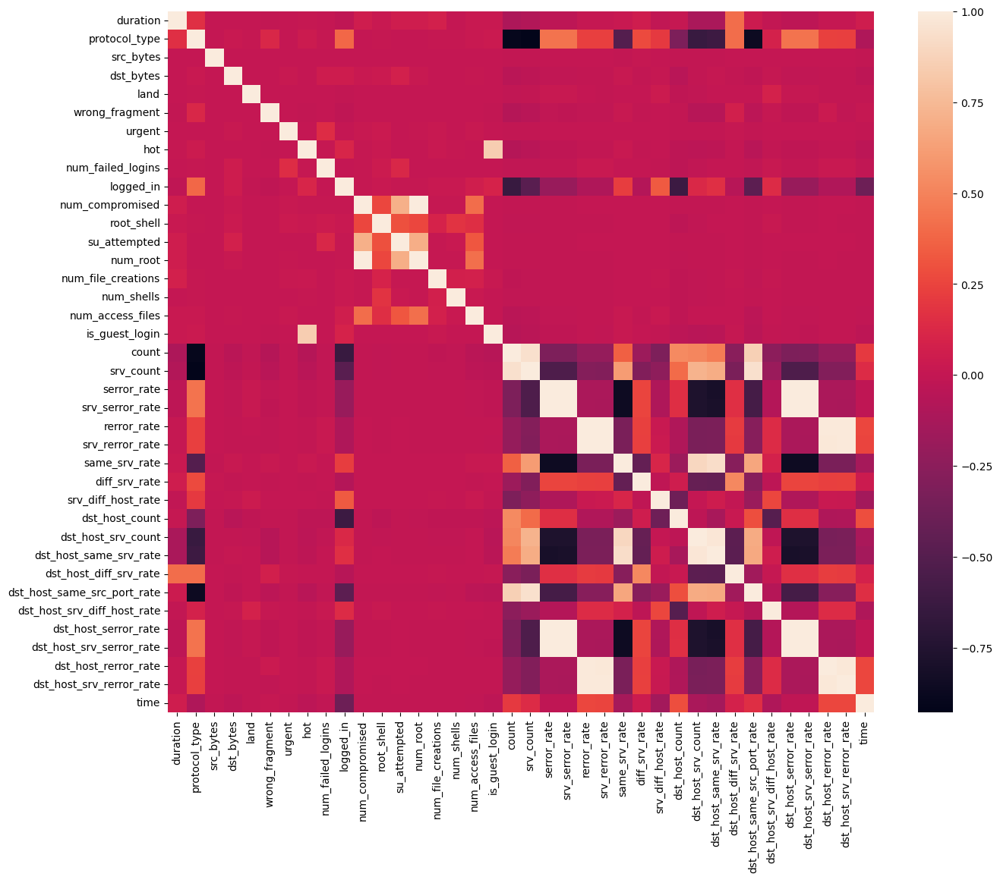
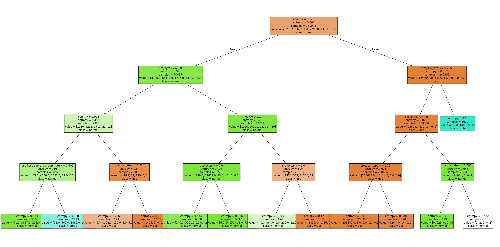
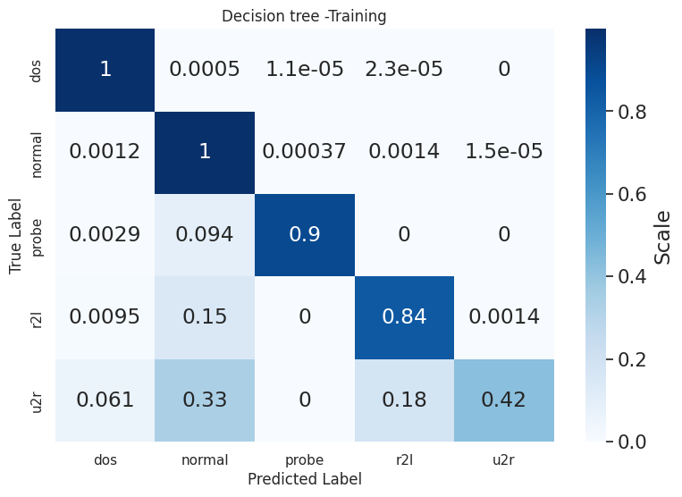
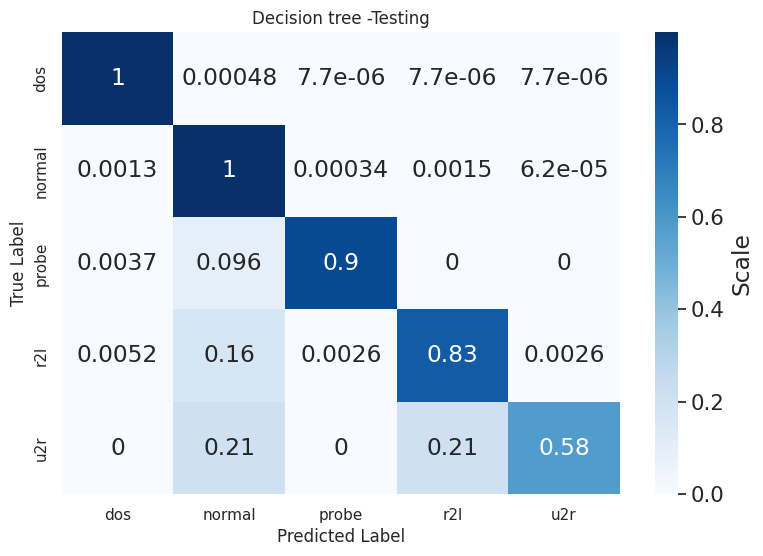
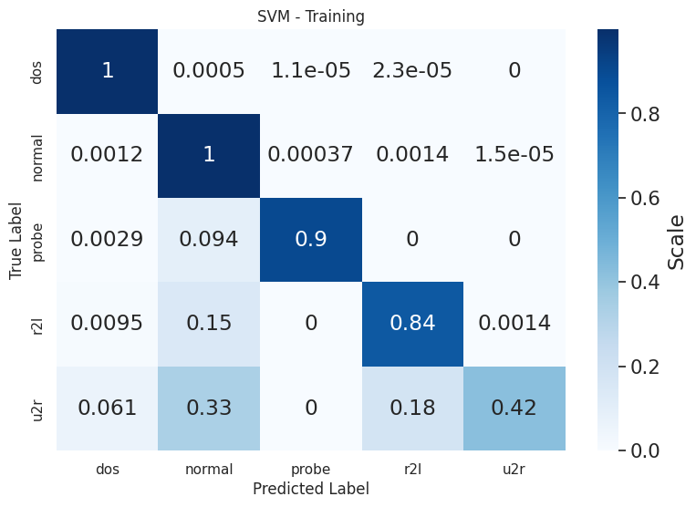
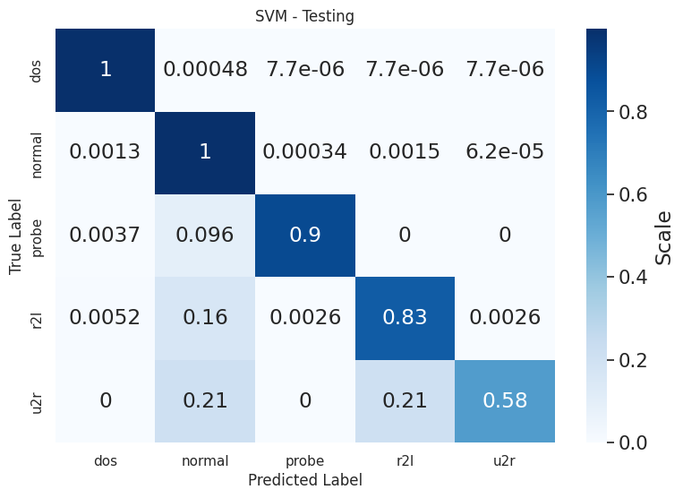
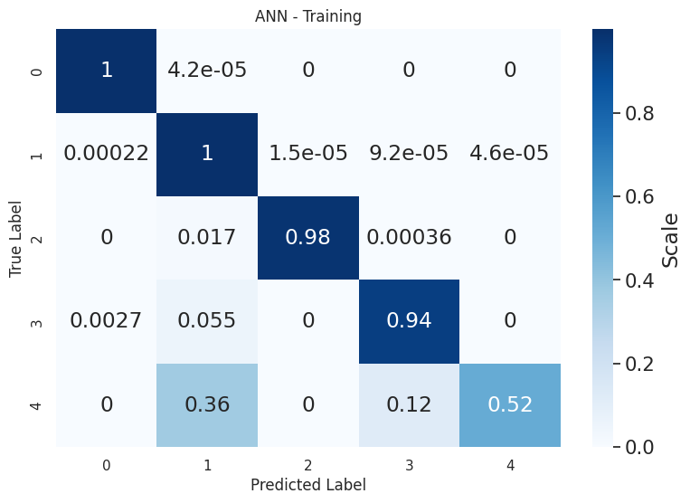
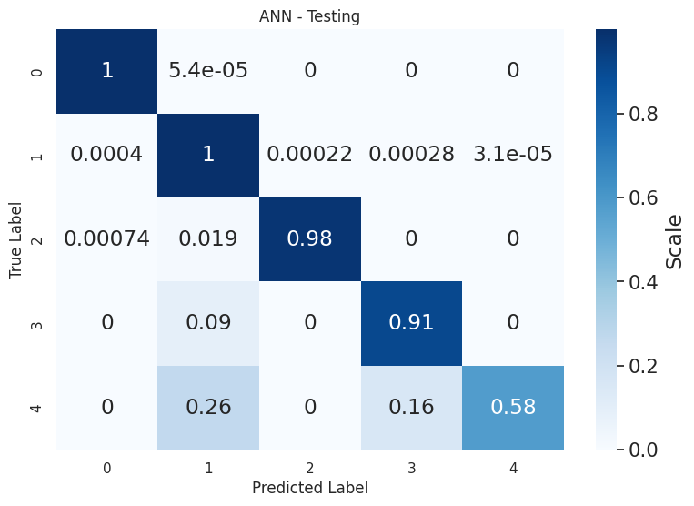

# Machine Learning Steps

## 0 Reading from InfluxDB
There are 494 021 rows and 46 columns in the dataset.

## 1 Data inspection
I define a bar plot function to visualize 4 different columns of the dataset:
target, Attack Type, Protocol Type and Service.

## 2 Feature transformation and cleaning
I convert protocol_type and flag to numerical values, remove service and target and drop colums with NaNs. 

## 3 Feature selection
I eliminate features that are not useful for the model training. I have now 32 features.
For this I use a correlation matrix to see the correlation between the features and the target.
I use a threshold of 0.98. Indeed, a correlation of 1 means that the two features are identical.
_np.triu()_ is used to avoid comparing the same features twice.
> This avoid overfitting the model and accelerate the training process.

## 4 Data sets preparation
I isolate the target variable (Attack Type) from the dataset in order to use the dataset to predict the target (unsupervised learning).
I normalize the dataset using _MinMaxScaler()_ and _fit\_transform()_ to scale the features to a range between 0 and 1.
I divide the dataset into 33% for testing and 67% for training.

## 5.1 Model training (DT = Decision Tree)
A decision tree is a machine learning model that takes decisions based on a series of questions on the features of the dataset.
A DT is great because we can visualize how it works inside, not like ANN.
I set up max_depth to 4 to avoid overfitting the model.

I use the entropy criterion to measure the quality of a split with the
_DecisionTreeClassifier()_ function. It is more precise than the gini criterion.

## 5.2 Model training (SVM = Support Vector Machine)
A SVM is a supervised learning model that can be used for classification or regression tasks. The goal of SVM is to find the best hyperplane that separates the data into different classes.

The kernel trick is a technique used by the SVM. If the data is not linearly separable, the kernel trick maps the data into a higher dimensional space where it is linearly separable. 
Here I use the linear kernel boundary.

## 5.3 Model training (ANN = Artificial Neural Network)
ANN are models, inspired by the human brain, composed of neurons layers, that trat data. Here I use 2 hidden layers (30 ReLu and 10 ReLu), and a softmax output.
I configure 50 epochs and an early stopping callback to stop the training when the validation loss does not improve for 5 epochs.

I encode labels, then I create the ANN function.
I use the _KerasClassifier()_ function to create the ANN model.

## 6 Model evaluation
Now that I have trained the three models, I can evaluate them using a confusion matrix and the accuracy score from sklearn.

## 7 Model Tunning
TODO

## 8 Saving trained models
I use joblib to save the trained models in a pickle file.
I can load them in Python for exemple
