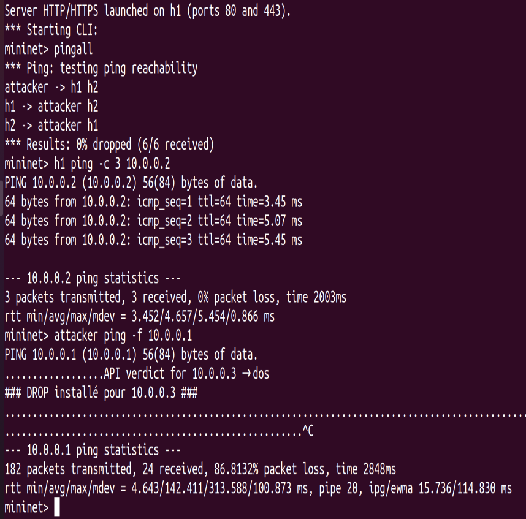

# ML-based Intrusion Detector

Main goal: To build a ML-based intrusion detector (classifier) capable of
distinguishing between normal connections and intrusions (attacks).

Objectives : 
* Retrieve training data from InfluxDB and build structured data frames.
* Train intrusion detector following main ML steps:
    - Data inspection and visualization
    - Feature selection
    - Model training (DT, SVM, ANN)
    - Model evaluation and selection
* Export trained model.
* Deploy trained model in GCP with Docker and an API using Flask and FastAPI.
* Test the model in a SDN topology with Mininet and Ryu controller.


## Attacks 
The attacks in the database are DDos, R2L, U2R and probing.

**DDoS** (Distributed Denial of Service) is when a large number of requests are sent to a server in a short time.

**R2L** (Remote to Local) is when an attacker tries to gain access to a remote system by exploiting vulnerabilities in the system (Ex: guessing passwords).

**U2R** (User to Root) is when an attacker tries to gain access to a system by exploiting vulnerabilities in the system (Ex: Buffer Overflow).

**Probing** is when an attacker tries to gain information about a system by sending requests to the system (Ex: Port scanning).


## Dataset
The dataset is from the KDD Cup 1999, which is a benchmark dataset for network intrusion detection systems. It was created by the MIT Lincoln Laboratory, and contains a wide variety of intrusions simulated in a military network environment. 


## Tools
- _Jupyter Notebook_
- _Python Libs_ : Pandas, Sklearn, Keras, Tensorflow,...
- _InfluxDB_ is used here to simulate a scenario where the data is stored in this database.
- _Telegraf_ is used here to collect the data from the database and send it to the ML-based intrusion detector.
- _Docker_ is used to create a container for the ML-based intrusion detector.
- _GCP_ is used to deploy the ML-based intrusion detector in the cloud.


## Installation
```bash
python3 -m venv venv
source venv/bin/activate
pip install -r requirements.txt
```

## Run the Flask App
```bash
python3 app_flask.py
```
## Run the FastAPI app (same app but different framework)
```bash
python3 -m uvicorn app_fastapi:app --reload --port 5000
```

## InfluxDB
We can either use the influx (-port 8089) command to connect to the database and write SQL queries or we can connect to the client using the influxdb python library.
```sql
SELECT COUNT("Attack Type") AS total FROM traffic GROUP BY "Attack Type"
```

## Telegraf
I use Telegraf to load the csv files into InfluxDB, to be able to do queries.


## Test for the API on Docker/Flask or GCP
```bash
python3 test_request.py
``` 
Prediction result:
{
    "confidence": 0.9999682903289795,
    "prediction": "normal",
    "status": "success"
}
First with the Flask App, then with the Docker.
I also have a shell script to test the API with the Docker image.


## Commands
$ jupyter notebook
go on http://localhost:8888/tree

sudo pkill -f influxd

launch the db server
$ influxd -config config/custom-influxdb.conf

connect to the shell client
$ influx -port 8089

load csv and send it to influxdb in the intrusion database
$ telegraf --config config/telegraf.conf


## GCP

## 1 Setup 
```bash
gcloud auth login
gcloud config set project $PROJECT_ID (attakx)
gcloud services enable \
  cloudbuild.googleapis.com \
  run.googleapis.com \
  artifactregistry.googleapis.com
```
## 2 Create Artifact Registry Repository
```bash
gcloud artifacts repositories create "attakx-repo" \
  --repository-format=docker \
  --location="europe-west9" \
  --description="Docker repository for Attakx"
```

## 3 Deploy on Cloud Run
→ gcp.bash

## 4 Test the API
I got the domain name :
https://attakx-service-507224908244.europe-west9.run.app/
I test it with the test_request.py file and it works.


## DEMO
I created an SDN topology with Mininet and Ryu controller. I used the Ryu controller to call the API and send the data to the ML-based IDS. I used the Mininet topology to simulate the network with 2 hosts, 2 switches and an attacker. We can see in the image below that:
- when the first host sends a ping to the second host, the API returns "normal", and the packets are sent to the second host.
- when the attacker sends a ping flood to the first host, the API returns "ddos", and the packets are dropped by more than 85%.


EOF